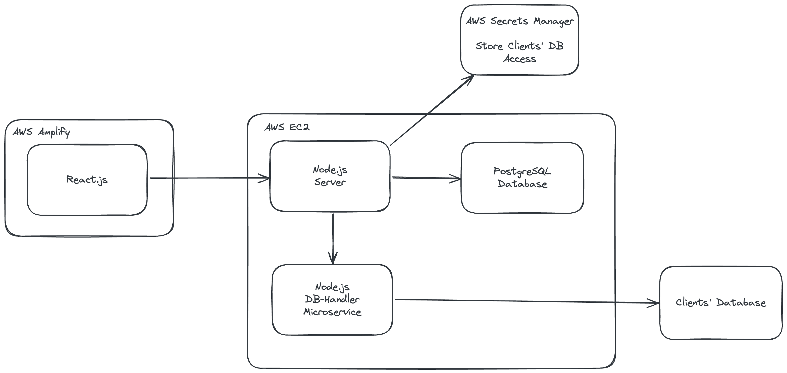

# ElasticDash

Hi there, welcome to ElasticDash! We are aiming to provide a no-code solution for non-tech people in businesses, allowing them to view, edit and modify the data as required.

This project is planned to be hosted on GitHub and be visible for the members in our private Slack channel. The tech stack and infrastructures would be described here in high-level.

If you have any questions, feel free to send message in this channel!

## Key Features

The key features for this project is to allow the people access, manage and modify data easily, without the need of SQL skills or the help from developers.

The users of this project is likely those who have no technical background but still need to access data for their daily work. This can be the business owners of small firms who wish to monitor the performance of the business, the UI designers who wish to see the user behaviours of the current user flow, and so on.

## Tech Stack

### Frontend: React

Among the three main stream frontend frameworks, we value React above the others for the easiness of development comparing to Angular, and the comprehensive support comparing to Vue. 

### Backend: Node.js + PostgreSQL

Node.js is known for its high performance for single thread task process. We are planning to use microservice infrastructure to handle high volume data processing in future.

PostgreSQL is for storing the data for our platform to operate. There will be no customer data to be stored in our end. We may store something like the name of databases, tables, or certain fields inside tables for customised configuration made by the customers, but those are the most we can possibly store.

### Secret Storage: AWS Secrets Manager

Since we need to store the database connection information without irreversible hashing, we choose AWS Secret Manager to store these sensitive data to prevent the potential risk of data leaking from our side.

By doing so, the hackers cannot get the data from our database.

### Host: AWS EC2 (Backend) + AWS Amplify (Frontend)

Currently, all the services are hosted on AWS EC2 and AWS Amplify for simple deployment and maintenance.

Hosting on AWS also lets us reliably manage the cybersecurity settings, which is essential for a data-heavy project like ElasticDash.

